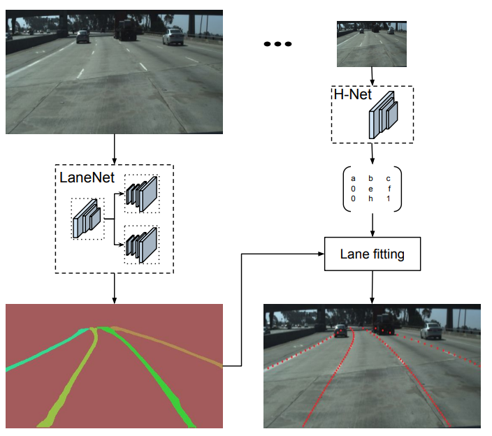
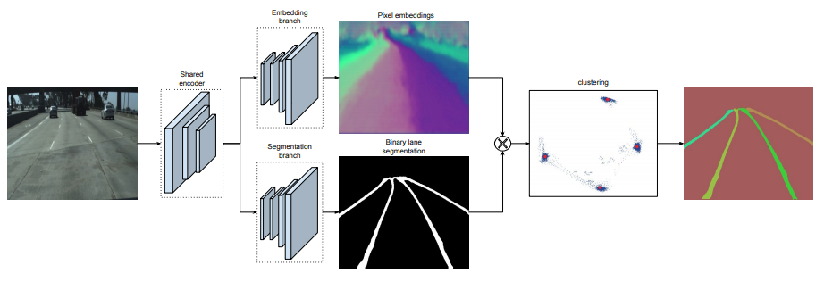
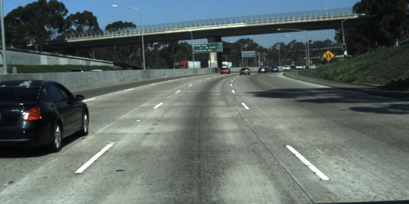
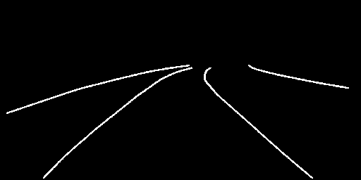
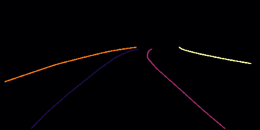
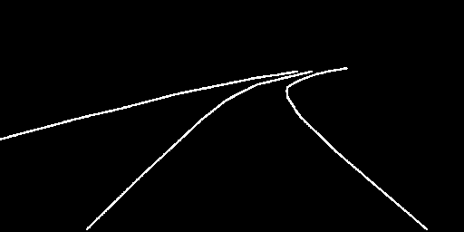
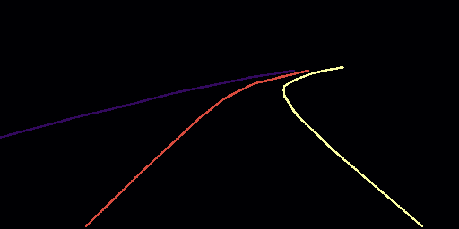
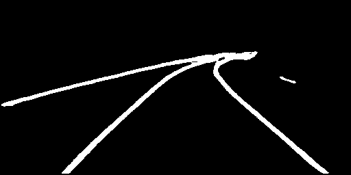
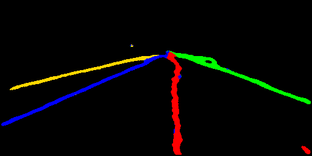
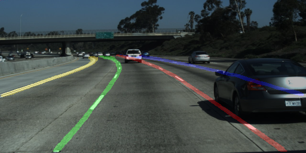

<h1 align="center">
Lane Detection using PyTorch
</h2>
<p align="center">

## Overview
This repository contains code written explicitly in [Python 3](https://www.python.org/) for lane detection. Moreover, [**PyTorch**](https://pytorch.org) framework is used to implement the LaneNet introduced in [Towards End-to-End Lane Detection: an Instance Segmentation Approach](https://arxiv.org/pdf/1802.05591.pdf). In this paper, authors propose to cast the lane detection problem as an end-to-end instance segmentation problem, in which each lane forms its own instance.

## Few words about the idea
<h3 align="center">
System Overview
</h4>
<p align="center">


Given an input image, LaneNet outputs a lane instance map, by labeling each lane pixel with a lane id. Next, the lane pixels are trasformed using the transformation matrix outputted by H-Net, which learns a perspective transformation conditioned on the input image. For each lane a 3rd order polynomial is fitted and the laned are reprojected onto the image.

<h3 align="center">
LaneNet Architecture
</h4>
<p align="center">


LaneNet architecture consists of two branches. The segmentation branch (bottom) is trained to produce a binary lane mask. The embedding branch (top) generates an N-dimensional embedding per lane pixel, so that embeddings from the same lane are close together and those from different lanes are far in the manifold. For simplicity we show a 2-dimensional embedding per pixel, which is visualized both as a color map (all pixels) and as points (only lane pixels) in a XY grid. After masking out the background pixels using the binary segmentation map from the segmentation branch, the lane embeddings (blue dots) are clustered together and assigned to their cluster centers (red dots).

## TUSIMPLE dataset
TUSIMPLE is a large scale dataset for testing Deep Learning methods on the lane detection task. It consists of 3626 training and 2782 testing images, under good and medium weather conditions. They are recorded on 2-lane/3-lane/4-lane or more highway roads, at different daytimes. For each image, they also provide the 19 previous frames, which are not annotated.The annotations come in a json format, indicating the xposition of the lanes at a number of discretized y-positions. On each image, the current (ego) lanes and left/right lanes are annotated and this is also expected on the test set. When changing lanes, a 5th lane can be added to avoid confusion.
<!---
___
## Table of Contents

- [Requirement](#Requirement)
- [Download and prepare the dataset](#Download-and-prepare-the-dataset)
- [Training the E-Net base LaneNet](#Training-the-E-Net-base-LaneNet)
- [Do evaluation on the test dataset](#Do-evaluation-on-the-test-dataset)
- [Generate some GIF to show the result](#Generate-some-GIF-to-show-the-result)
- [Reference](#Reference)
--->
___
## Requirements
* [PyTorch](https://pytorch.org)
* [torchvision](https://pytorch.org/docs/stable/torchvision/index.html#torchvision)
* [torch-scatter](https://github.com/rusty1s/pytorch_scatter)
* [sklearn](https://scikit-learn.org/stable/)
* [NumPy](https://numpy.org)
* [Matplotlib](https://matplotlib.org/)
* [OpenCV](https://opencv.org/)
* [tqdm](https://github.com/tqdm/tqdm)
* [shutil](https://docs.python.org/3/library/shutil.html)
* [ujson](https://github.com/ultrajson/ultrajson)

## Install requirements
In order to install requirements run ``pip install -r requirements.txt``

## Download TUSIMPLE dataset
Firstly, we have to download the Lane Detection Challenge dataset from [TUSIMPLE](https://github.com/TuSimple/tusimple-benchmark/issues/3) GitHub repository.

Moreover:

1. Download [**train_set.zip**](https://s3.us-east-2.amazonaws.com/benchmark-frontend/datasets/1/train_set.zip) and unzip it to folder ``Lane_Detection_PyTorch/TUSIMPLE``
2. Download [**test_set.zip**](https://s3.us-east-2.amazonaws.com/benchmark-frontend/datasets/1/test_set.zip) and unzip it to folder ``Lane_Detection_PyTorch/TUSIMPLE`` 
3. Download [**test_label.json**](https://s3.us-east-2.amazonaws.com/benchmark-frontend/truth/1/test_label.json) and put it into the folder ``Lane_Detection_PyTorch/TUSIMPLE/test_set`` which is unzipped from ``test_set.zip``

## Prepare TUSIMPLE dataset
After we have downloaded the dataset from TUSIMPLE GitHub repository, some preprocess is needed to prepare the dataset for training and testing.

We process the ``train_set`` and split it into ground truth images, binary ground truth images and instance ground truth images. Those images are stored into respective folders. We run the following file in Terminal:

```
python utils/process_train_set.py --src_dir /path/to/your/extracted/train_set
```

The ``src_dir`` is your local directory, where the ``train_set`` was previously extracted.

We can now delete the folder ``Lane_Detection_PyTorch/TUSIMPLE/train_set`` and json files in ``Lane_Detection_PyTorch/TUSIMPLE/training``

Let us have a look on ``TUSIMPLE/`` folder to find out how should it look like now:
```
Lane_Detection_PyTorch
|---TUSIMPLE
    |---Lanenet_output
    |   |--lanenet_epoch_39_batch_8.model
    |   |--lanenet_epoch_39_batch_8_AUG.model
    |   |--lanenet_epoch_38_batch_8_AUG.model
    |
    |---training
    |   |--lgt_binary_image
    |   |--gt_image
    |   |--gt_instance_image
    |
    |---txt_for_local
    |   |--test.txt
    |   |--train.txt
    |   |--val.txt
    |
    |---test_set
    |   |--clips
    |   |--test_tasks_0627.json
    |   |--test_label.json
    |   |--readme.md
    |
    |---test_clips
```

## Visualize TUSIMPLE dataset
Let us have a look on TUSIMPLE dataset. We run the following file in Terminal:

```
python dataset/visualize_dataset.py
```

This file is creating a ``dataset/samples`` folder, in which it saves some sample images (original, binary lane segmentation, instance segmentation).

<h3 align="center">
Original Sample Image
</h4>
<p align="center">


<h3 align="center">
Binary Lane Segmentation Image
</h4>
<p align="center">


<h3 align="center">
Instance Segmentation Image
</h4>
<p align="center">


Notice that when building the dataset for visualization, ```dataset_utils.py``` has two different options:
1. ``TUSIMPLE`` corresponds to the original dataset
2. ``TUSIMPLE_AUG`` corresponds to the augmented dataset

Play with the visualizations in order to gain good insight on dataset and augmentation.

## Train LaneNet
We train LaneNet on TUSIMPLE dataset by running:

```
python train.py
```

This will save the trained model on ``TUSIMPLE/Lanenet_output``.

Notice that there is a chance to either train the network using the augmented or non-augmented data. The choice is yours. Uncomment the respective lines in code to do whatever you prefer. 

## Evaluate LaneNet on test set
Information about the official TUSIMPLE evaluation method can be seen in the [TUSIMPLE evaluation example](https://github.com/TuSimple/tusimple-benchmark/blob/master/example/lane_demo.ipynb).

We evaluate LaneNet by running:

```
python evaluate.py
```

Notice that we first load the model previously trained and then evaluate it both using accuracy and duration metrics.

The accuracy metrics are reported below:

|                | Accuracy   |    FP   |    FN   |
|:-------------- |:-----------|:--------|:--------|
| Authors        |   96.40%   | 0.0780  |  0.0244 |  
| Our Results    |   94.27%   | 0.1479  |  0.7129 |
| Our Aug Results|   94.72%   | 0.1328  |  0.6248 |

The duration metrics are reported bleow:

|               | Authors Time (ms)| Our Time (ms)| Authors FPS| Our FPS|
|:--------------|:-----------------|:-------------|:-----------|:-------|
| Forward Pass  | 12.0             | 23.9         |62.5        |41.8    |
| Clustering    | 4.6              | 66.09        |62.5        |15.1    |

Authors use the ``NVIDIA 1080 Ti``, while we use the ``RTX 3070``.

<!--
## Generate some GIF to show the result

Use the ``ECBM6040-Project/Notebook-experiment/Generate Video and show the result.ipynb``, you can generate some gif to show the result on some clips in ``ECBM6040-Project/TUSIMPLE/test_clips`` and output gif will find in ``ECBM6040-Project/TUSIMPLE/gif_output``
-->
## Visualize results
We visualize results by running:
```
python visualize_results.py
```
This file outputs the following images, which are saved in the `TUSIMPLE/test_clips` as:
```
Lane_Detection_PyTorch
|---TUSIMPLE
    |---test_clips
    |   |---groundthruths
            |--sample_image.png
            |--binary_groundtruth_sample_image.png
            |--instance_segmentation_sample_image.png
        |---predictions
            |--binary_prediction_sample_image.png
            |--instance_prediction_sample_image.png
            |--final_detection_sample_image.png
```
<h3 align="center">
Original Sample Image
</h4>
<p align="center">

<h3 align="center">
Binary Lane Segmentation Groundtruth Image
</h4>
<p align="center">

<h3 align="center">
Instance Segmentation Groundtruth Image
</h4>
<p align="center">

<h3 align="center">
Binary Lane Segmentation Prediction Image
</h4>
<p align="center">

<h3 align="center">
Instance Segmentation Prediction Image
</h4>
<p align="center">

<h3 align="center">
Final Lane Detection Image
</h4>
<p align="center">


## Generate video
We also generate a GIF for better visualization by running:
```
python generate_video.py
```
The ouput of this file is saved in `TUSIMPLE/gif_output` directory. An example video is showed below:
<h3 align="center">
Final Lane Detection GIF
</h4>
<p align="center">


<!--
___
## Reference
[1] Neven, D., De Brabandere, B., Georgoulis, S., Proesmans, M. and Van Gool, L., 2018, June. Towards end-to-end lane 
detection: an instance segmentation approach. In 2018 IEEE intelligent vehicles symposium (IV) (pp. 286-291). IEEE. 
https://arxiv.org/abs/1802.05591

[2] LaneNet TensorFlow project https://github.com/MaybeShewill-CV/lanenet-lane-detection

[3] TuSimple Dataset https://github.com/TuSimple/tusimple-benchmark

[4] E-Net Project https://github.com/davidtvs/PyTorch-ENet
-->